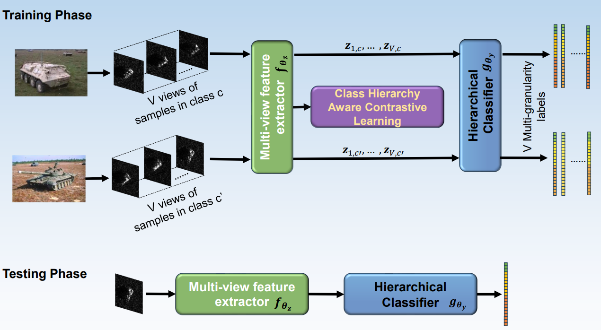

# CHA-CFL

This repository is part of the source code for  paper(currently early access version):

​	[Class Hierarchy Aware Contrastive Feature Learning for Multi-Granularity SAR Target Recognition](https://ieeexplore.ieee.org/document/10582307). 


The code is conducted under official PyTorch library, and pre-trained models are available for CHA-CFL. Hoping it's helpful!

## Update

*Due to the requirements of PLA, currently we only open-source the pre-trained models. We will open source the overall model as soon as it's available.*

- 2024-07-07: update the testing code.
- TODO: upload the pre-trained models.

## Introduction



To fully explore the label distribution of images, we use CHA-CFL to find the hierarchical similarity in categories. The source code of Multi-view Feature Extractor is included in this repository.

## Get Started

The key environment we use are as below:

- GPU: 2070 Super
- CUDA: 12.1
- PyTorch: 1.13.0
- Numpy: 1.26.3
  

We provide both python file and jupyter notebook file for testing. When running the code, only sampling_rate variable is needed to change within[10, 20, 30, 40, 50]. 


## Pretrained Models

| dataset | dataset sampling rate(%) | accuracy(%) |    link    |
| :-----: | :----------------------: | :---------: | :--------: |
|   soc   |            10            |      -      | In process |
|   soc   |            20            |      -      | In process |
|   soc   |            30            |      -      | In process |
|   soc   |            40            |      -      | In process |
|   soc   |            50            |      -      | In process |

## Contact

If you have any questions, please feel free to contact the authors. Both the e-mails below are available.

- [wenzaidao@nwpu.edu.cn](mailto:wenzaidao@nwpu.edu.cn) 
- [wangzikai@mail.nwpu.edu.cn](mailto:wangzikai@mail.nwpu.edu.cn)(recommended)

## Acknowledgement

- Our code structure is build under [AConvNet-pytorch](https://github.com/jangsoopark/AConvNet-pytorch) folder system. It's also available to download the datasets from this [link](https://github.com/jangsoopark/AConvNet-pytorch/releases/download/v2.2.0/dataset.zip).
- The inspiration of Class Hierarchy Aware Contrastive Learning is from [hierarchicalContrastiveLearning](https://github.com/salesforce/hierarchicalContrastiveLearning). We rewrite the loss and applied in our structure.

## Citation

If you find our work is useful in your research, please consider citing:

```tex
@ARTICLE{10582307,
  author={Wen, Zaidao and Wang, Zikai and Zhang, Jianting and Lv, Yafei and Wu, Qian},
  journal={IEEE Transactions on Aerospace and Electronic Systems}, 
  title={Class Hierarchy Aware Contrastive Feature Learning for Multi-Granularity SAR Target Recognition}, 
  year={2024},
  volume={},
  number={},
  pages={1-17},
  keywords={Feature extraction;Synthetic aperture radar;Training;Task analysis;Data mining;Aerospace and electronic systems;Vectors;Contrastive feature learning;hierarchical classification;multi-granularity target recognition;synthetic aperture radar (SAR)},
  doi={10.1109/TAES.2024.3421171}}

```


